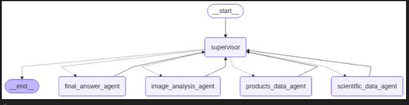

# Multi-Agent Hair Care Specialist

## Overview
The Multi-Agent Hair Care Specialist is an intelligent system designed to provide personalized hair care recommendations. It leverages multiple specialized agents to analyze user inputs, retrieve scientific data, and suggest suitable products based on individual needs.

## Features
- **Image Analysis**: Analyzes hair images to determine hair type and condition.
- **Scientific Data Retrieval**: Fetches relevant scientific studies and data.
- **Product Recommendations**: Provides detailed product suggestions tailored to the user's hair type.
- **Supervisor Agent**: Orchestrates the workflow and ensures smooth communication between agents.

## Architecture
The system is built using a modular architecture where each agent performs a specific task. All agents communicate with the Supervisor, which acts as the central node. The architecture ensures scalability and maintainability.



## Installation
1. Clone the repository:
   ```bash
   git clone https://github.com/mo7amedmengasu/mulit_agent_hair_care_specialist.git
   ```
2. Navigate to the project directory:
   ```bash
   cd mulit_agent_hair_care_specialist
   ```
3. Install dependencies:
   ```bash
   pip install -r requirements.txt
   ```

## Usage
1. Run the main application:
   ```bash
   python app/main.py
   ```
2. Interact with the system through the provided interface or API.

## Contributing
Contributions are welcome! Please fork the repository and submit a pull request.

